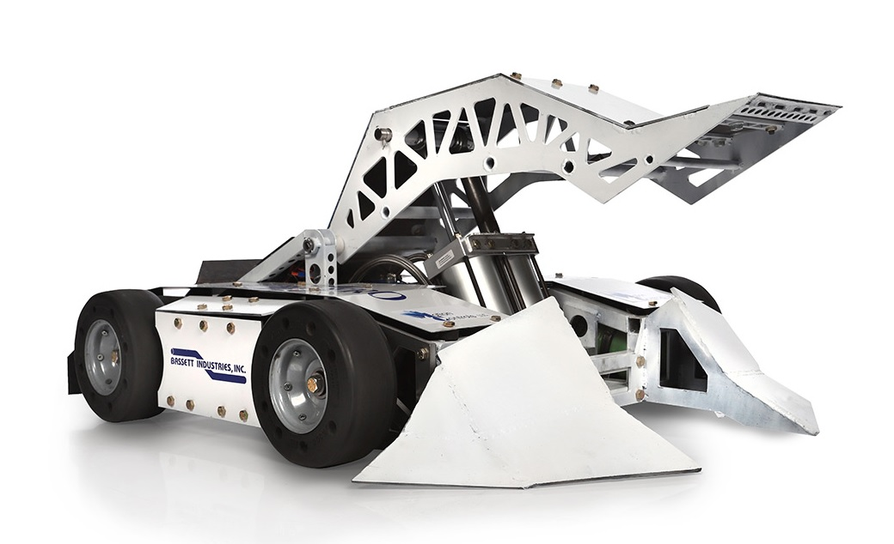

  

                                                                  
<h3 align="center">Arm Flipper Subzero 2020</h3>

## Introduction
The goal of this project was to model a battle bot in OpenGL given a picture. The bot is interactive and can be controlled using keyboard keys. Applying simple geometric transformations, the bot can move forwards and backwards, turn and activate its weapon. 

## Installation
1. Clone repository
2. Ensure you have C++ and C libraries installed
3. Install OpenGL (instructins vary depending on your operating system)
- this part may be tricky, as you must ensure you have OpenGL, GLUT and GLEW frameworks
4. Navigate to the directory of the project and compile using the following command:

``g++ ArmFlipper.cpp QuadMesh.cpp -o ArmFlipper -framework OpenGL -framework GLUT``

## Bot Controls
 * `f`- move bot forwards 
 * `b` - move bot backwards 
 * `↑` - activate weapon
 * `←` - turn left 
 * `→` - turn right
 * `s` - spin flag
 * `S` - stop spinning flag
 * `q` - quit program

Note: Press `F1` to see the instructions on how to interact with the battle bot. The instructions will appear on the console window.

## Screenshots

  

 

  

 
